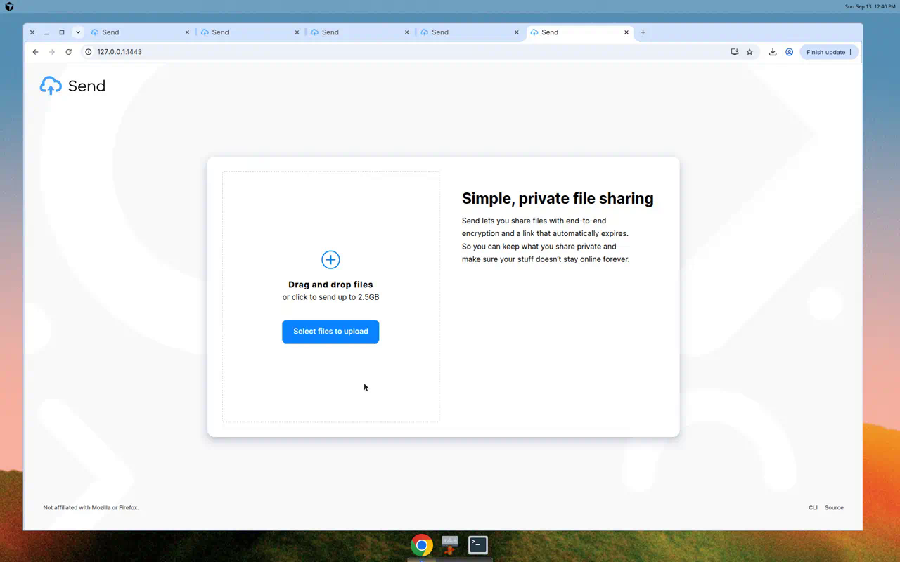
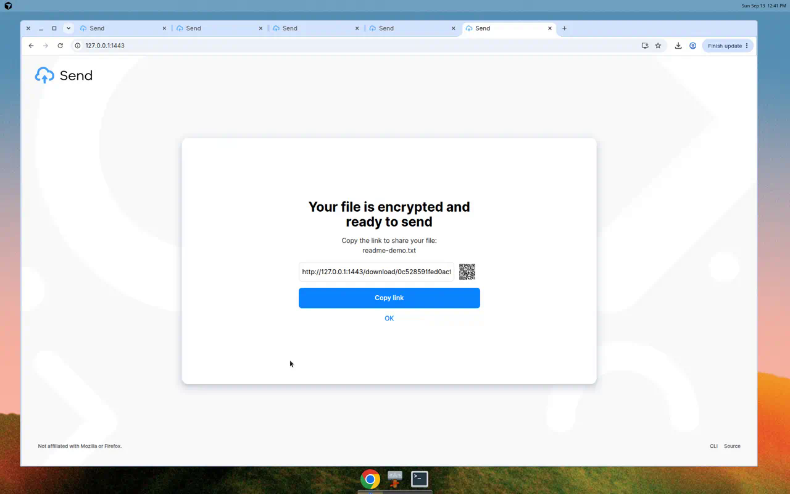

# Send

[](LICENSE)

Private, encrypted file sharing. Upload from the browser; the ciphertext is all
the server ever stores. Share a link that carries the decryption key in the URL
fragment (`#…`) so it never reaches the server.

This repository is a community fork of Mozilla’s discontinued
[Firefox Send](https://github.com/mozilla/send), rewritten for **Bun**,
**Hono**, and **React**. Branding from Mozilla / Firefox has been removed so
you can self-host. See [Credits](#credits).



**Docs:** [FAQ](docs/faq.md) · [Encryption](docs/encryption.md) · [Docker](docs/docker.md) · [Deployment](docs/deployment.md) · [Build](docs/build.md) · [Localization](docs/localization.md)

---

## Features

- End-to-end encryption in the browser (AES-GCM / Web Crypto)
- Optional password on downloads
- Expiry time and download-count limits
- Multi-file archives
- Local disk, S3-compatible, or GCS storage
- Optional Firefox Accounts (FxA) gate
- Fluent (`ftl`) localization

## Tech stack

| Layer | Choice |
| --- | --- |
| Runtime / package manager | [Bun](https://bun.sh) ≥ 1.4 |
| HTTP / WebSocket | [Hono](https://hono.dev) on `Bun.serve` |
| UI | React 19, React Router, Zustand |
| CSS | Tailwind CSS v4 |
| Config / validation | Zod |
| Lint / format | Biome |
| Unit tests | `bun test` |
| E2E | Playwright |

## Directory layout

```
src/
  client/          React SPA (pages, components, i18n)
  core/            Shared crypto, upload/download, zip
  server/          Hono app, routes, storage, WS upload
scripts/           build + version helpers
public/locales/    Fluent translations
dist/              Production assets (after `bun run build`)
docs/              Project documentation
e2e/               Playwright smoke tests
```

## Requirements

- [Bun](https://bun.sh) ≥ 1.4
- Redis — **optional in development** when `REDIS_HOST=localhost` (in-memory stub). Required for production.
- Optional: S3-compatible bucket or GCS for blob storage (otherwise files go under `FILE_DIR`)

## Quick start (development)

```bash
git clone https://github.com/6078HITHEDAY/send.git
cd send
bun install
cp .env.example .env   # defaults are fine for local demo
bun run start
```

Open [http://localhost:1443](http://localhost:1443).

`bun run start` runs the Bun/Hono app with hot reload (`src/server/dev.ts`).
With the default `.env`, Redis is not required.

## Configuration

Environment variables are loaded in [`src/server/config.ts`](src/server/config.ts).
A commented template is in [`.env.example`](.env.example).

| Variable | Default | Notes |
| --- | --- | --- |
| `PORT` | `1443` | Listen port |
| `IP_ADDRESS` | `0.0.0.0` | Listen address |
| `BASE_URL` | `https://send.example.com` | Absolute URL used in share links |
| `DETECT_BASE_URL` | `false` | Derive base URL from the incoming request |
| `NODE_ENV` | `development` | `development` \| `production` \| `test` |
| `REDIS_HOST` | `localhost` | In-memory Redis when `localhost` + development/test |
| `FILE_DIR` | temp dir | Local blob directory when not using S3/GCS |
| `S3_BUCKET` / `GCS_BUCKET` | empty | Enable object storage when set |
| `MAX_FILE_SIZE` | ~2.5 GiB | Bytes |
| `DEFAULT_EXPIRE_SECONDS` | `86400` | 1 day |
| `DEFAULT_DOWNLOADS` | `1` | |
| `FXA_CLIENT_ID` | empty | Empty disables FxA |

See `.env.example` for the full list (limits, UI chrome, Sentry, notices).

## Scripts

| Command | Purpose |
| --- | --- |
| `bun run start` | Dev server + HMR on port `1443` |
| `bun run build` | Write `dist/` production assets |
| `bun run prod` | Serve production build (`src/server/prod.ts`) |
| `bun test` | Unit / integration tests |
| `bun run test:e2e` | Playwright smoke (upload → download) |
| `bun run typecheck` | `tsc --noEmit` |
| `bun run lint` | Biome check |
| `bun run lint:fix` | Biome check + write |
| `bun run format` | Biome format |

## Production build

```bash
bun install --frozen-lockfile
bun run build
NODE_ENV=production BASE_URL=https://send.example.com REDIS_HOST=redis bun run prod
```

Put a reverse proxy (Caddy, nginx, Traefik) in front for TLS. Set `BASE_URL` to
the public HTTPS origin.

## Docker

Build and run with Compose (app + Redis):

```bash
docker compose up --build
```

App: [http://localhost:1443](http://localhost:1443).

Or build the image alone (Linux Docker Engine needs `--add-host`; prefer Compose):

```bash
docker build -t ghcr.io/6078hitheday/send:latest .
docker run --rm -p 1443:1443 \
  --add-host=host.docker.internal:host-gateway \
  -e NODE_ENV=production \
  -e BASE_URL=http://localhost:1443 \
  -e REDIS_HOST=host.docker.internal \
  ghcr.io/6078hitheday/send:latest
```

Details: [docs/docker.md](docs/docker.md).

## Testing

```bash
bun test
bun run typecheck
bun run lint
bun run build
# optional browser smoke (installs browsers on first run)
bunx playwright install chromium
bun run test:e2e
```

## Usage example

1. Open the homepage and choose a file (or drop several for an archive).
2. Optionally set a password, expiry, and download limit.
3. Upload — the client encrypts before upload.
4. Copy the share link. It looks like  
   `https://your.host/download/<id>#<secret>`  
   The `#<secret>` fragment is never sent to the server.
5. Open the link in another browser / private window and download. Wrong
   passwords are rejected; after the download limit the link expires.



## FAQ

See [docs/faq.md](docs/faq.md) for size limits, browser support, password
behaviour, and self-hosting tips.

## Contributing

Please read [CONTRIBUTING.md](CONTRIBUTING.md) and the
[Code of Conduct](CODE_OF_CONDUCT.md). Issues and pull requests:
https://github.com/6078HITHEDAY/send/issues

## Credits

- Original [Firefox Send](https://github.com/mozilla/send) by [Mozilla](https://www.mozilla.org/)
- Long-running community fork work by [Tim Visee](https://github.com/timvisee) and contributors
- This tree continues that lineage on Bun / Hono / React

## License

[MPL-2.0](LICENSE)
